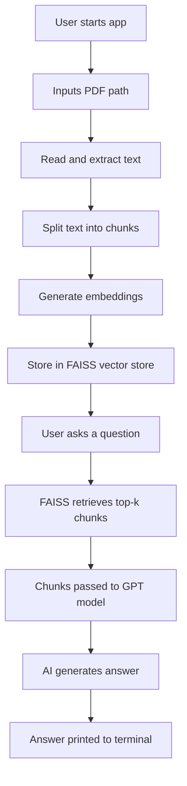

# 🧠 PDF Q&A with RAG (Retrieval-Augmented Generation)

This project is a simple, terminal-based application that allows users to ask questions about a PDF document. It uses OpenAI's GPT models along with semantic search via FAISS and embeddings to provide accurate, context-aware answers from the PDF file you supply at runtime.

---

## 📦 1. Setup Guide

### ✅ Requirements

- Python 3.8+
- OpenAI API key

### 🛠️ Installation

```bash
# Clone the repo
git clone https://github.com/DilshanParis/llm-pdf-reader.git
cd pdf-rag

# Create a virtual environment (optional but recommended)
python -m venv .venv
source .venv/bin/activate  # On Windows: .venv\Scripts\activate

# Install dependencies
pip install -r requirements.txt
```

### 🔐 Set Your API Key

Create a `.env` file in the project root:

```
OPENAI_API_KEY=sk-...
```

---

## 📘 2. Intro & How It Works

This app reads a PDF document, chunks and embeds the content using OpenAI Embeddings, and stores them in an in-memory FAISS vector store. When the user asks a question, it retrieves the most relevant chunks and passes them to GPT to generate an answer.

### 🔁 Flow

1. **User inputs a PDF path**
2. PDF is read and split into chunks
3. Each chunk is embedded and stored
4. User asks a question
5. FAISS retrieves relevant text chunks
6. GPT answers based on those chunks

---

## ⚙️ 3. Logics

### Main Components:

| Component                        | Logic                                                        |
| -------------------------------- | ------------------------------------------------------------ |
| `read_pdf()`                     | Extracts text from all pages of the PDF                      |
| `RecursiveCharacterTextSplitter` | Splits text into manageable chunks for embedding             |
| `OpenAIEmbeddings()`             | Converts text chunks to numerical embeddings                 |
| `FAISS`                          | Stores and retrieves relevant chunks based on user questions |
| `RetrievalQA`                    | Combines retrieval with GPT response generation              |

### Key Parameters:

- `chunk_size=500`, `chunk_overlap=50`
- `temperature=0` for deterministic answers

---

## 🔁 4. Mermaid Flowchart



---

## 🧩 5. Weaknesses and Future Improvements

### 🚫 Current Limitations

- Requires internet for OpenAI API
- All processing is done in-memory (no persistent DB)
- Cannot handle scanned PDFs (OCR needed)
- Minimal error handling
- No GUI (only terminal-based)

### 💡 Future Improvements

- Add **support for scanned/image PDFs** using OCR (e.g., Tesseract)
- Use **local embeddings and models** (e.g., `sentence-transformers`, `llama.cpp`)
- Implement **persistent vector store** (e.g., ChromaDB or Pinecone)
- Build a **Streamlit/Gradio web interface**
- Add **multi-PDF support** and document indexing

---

## ✅ Example Usage

```bash
$ python rag_from_pdf.py
Enter the full path to your PDF file: data/sample.pdf
[*] Reading and processing PDF...
[*] Ready for questions! Type 'exit' to quit.
You: What is the main idea of this document?
AI: The document discusses...
```

---

## 👤 Author

Built with 💬 by [Dilshan Paris]
